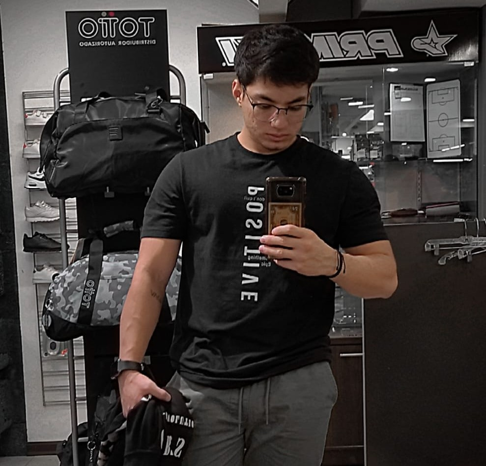

# 🚀 Anthony Portfolio

> Portfolio profesional de **Anthony Mejia** - Desarrollador Full Stack especializado en tecnologías modernas.



## ✨ Características

- 📱 **PWA** - Progressive Web App completamente funcional
- ⚡ **Performance** - Optimizado con Vite y lazy loading
- 🎨 **Responsive Design** - Funciona perfectamente en todos los dispositivos
- 🔍 **SEO Optimizado** - Meta tags, sitemap y structured data
- 🌙 **Smooth Animations** - Framer Motion para transiciones fluidas
- 🗜️ **Compresión** - Gzip y Brotli para máximo rendimiento
- 🔧 **Service Worker** - Caching inteligente para experiencia offline

## 🛠️ Tecnologías

- **Frontend:** React 19, Vite 7
- **Styling:** CSS Modules, CSS Custom Properties
- **Animations:** Framer Motion
- **Icons:** React Icons
- **PWA:** Service Worker, Web App Manifest
- **SEO:** Sitemap, Robots.txt, Meta tags
- **Performance:** Compression, Bundle optimization

## 🚀 Comandos

```bash
# Desarrollo
npm run dev

# Build production
npm run build

# Build completo con optimizaciones
npm run build:full

# Solo generar sitemap
npm run sitemap

# Solo optimizar SEO
npm run seo

# Preparar para deploy
npm run deploy:prep

# Preview local
npm run preview